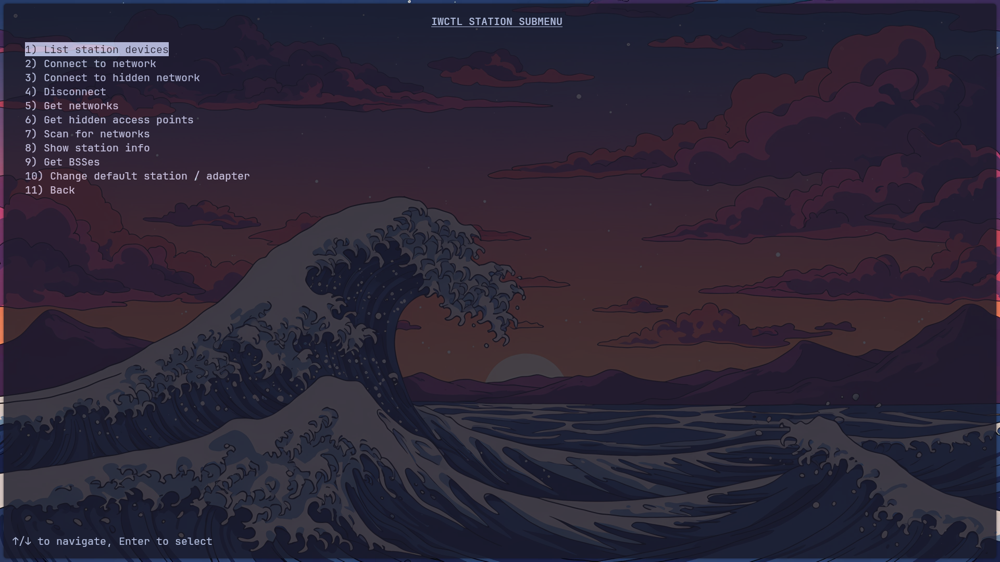
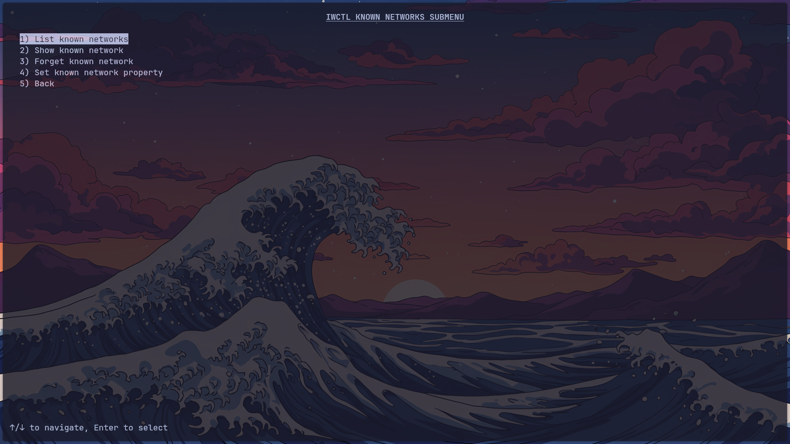

# Arch-Linux-Internet Wireless Daemon-IWD-TUI-Helper
Simple IWD TUI 

IWD has never let me down in terms of reliability.  
It doesn’t break after updates, doesn’t randomly crash, and it just works!

If you’re like me and:
- forget `iwctl` commands,
- are tired of constantly googling them,
- want fast and simple Wi-Fi management,

then this **IWD Helper TUI** is for you.

---

## Features

- Simple **column-based TUI**
- Keyboard-only navigation
  - ↑ / ↓ to move
  - **ENTER** to select
- Fully integrated with your terminal’s theme
- Uses **iwctl** directly (no abstraction layer)
- Saves your default **station** and **adapter**
- Covers **all iwctl commands**

---

## Requirements

- Linux system using **iwd** (Intel Wireless Daemon)
- The command **`iwctl`** must be available in `$PATH`
- **Python 3.8+**
- No Python dependencies (standard library only)

Most Arch-based distributions ship with `iwd` enabled by default.  
On a clean Arch Linux install, you may need to install it manually.

### Check if `iwctl` is installed

```bash
pacman -Qi iwd
```
If that command works, you’re good to go.

If not, install IWD:

```bash
sudo pacman -S iwd
```
Enable and start the service if needed:

```bash
sudo systemctl enable --now iwd.service
```
## Installation
Clone the repository: 
```bash
git clone https://github.com/NT411/Arch-Linux-Intel-Wireless-Daemon-IWD-TUI-Helper
```

Open the repo folder:
```bash 
cd Arch-Linux-Intel-Wireless-Daemon-IWD-TUI-Helper
```

Run the TUI:

```bash
python iwctl_helper.py
```
## On first launch, the program will:

1) Run iwctl device list

2) Ask for your default station (wlan) and adapter (phy)

3) Save them to: ~/.config/iwctl-helper/config.json

## Notes

You may need to run the script as root or configure polkit rules,
depending on how your system allows Wi-Fi management.

The TUI uses your terminal’s default colors and transparency.

Enjoy fast, reliable, and always-working IWD

No more memorizing commands. No more Googling.

## Screenshots

### Main Menu


### Station Menu


### Known Networks Menu

